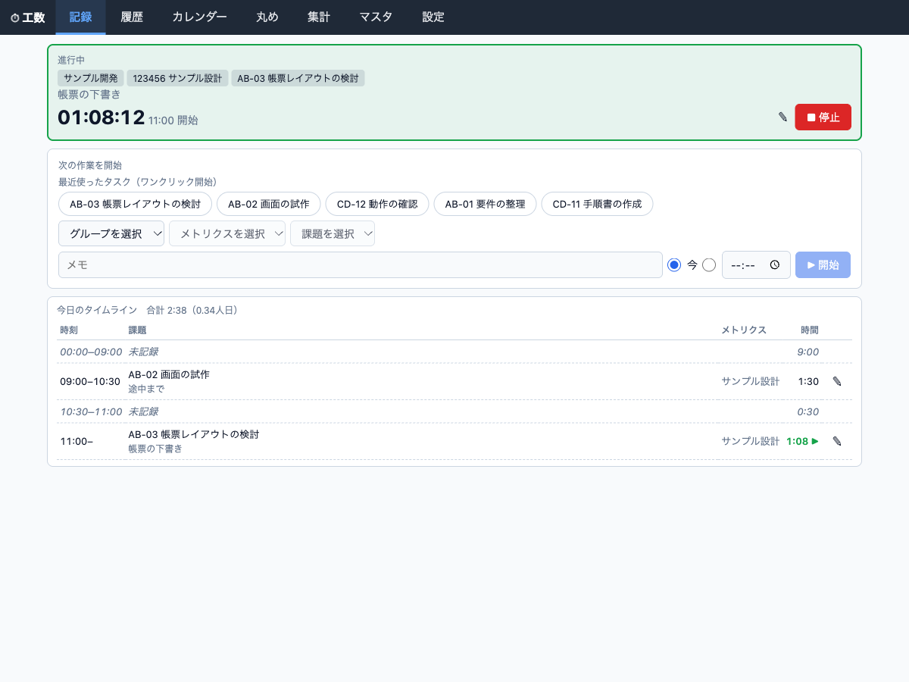
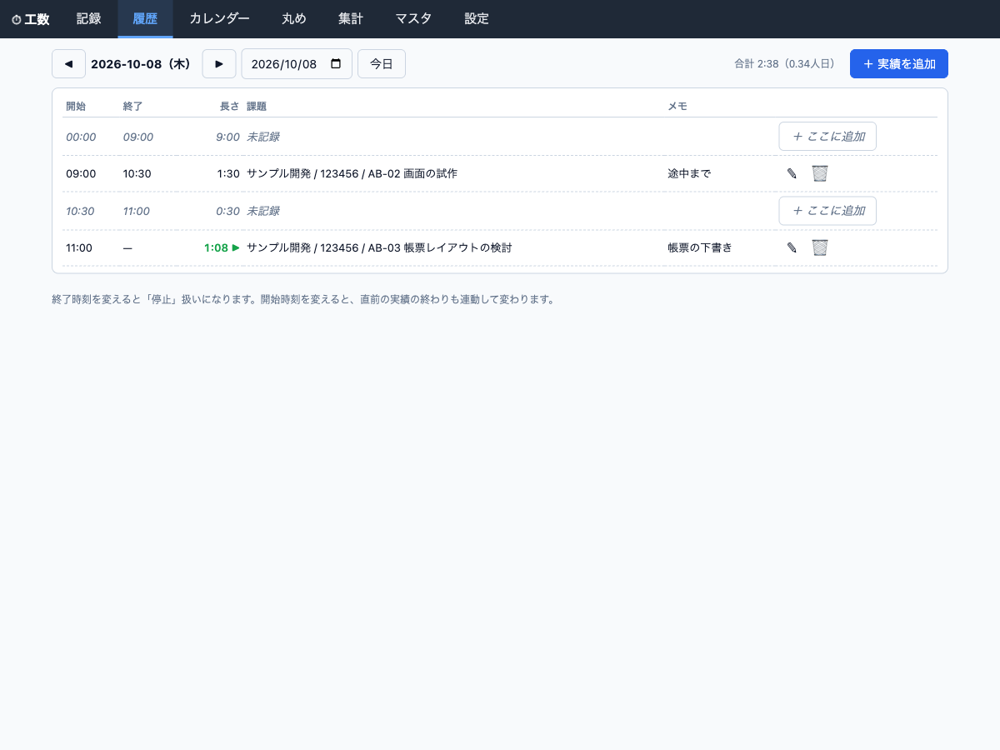
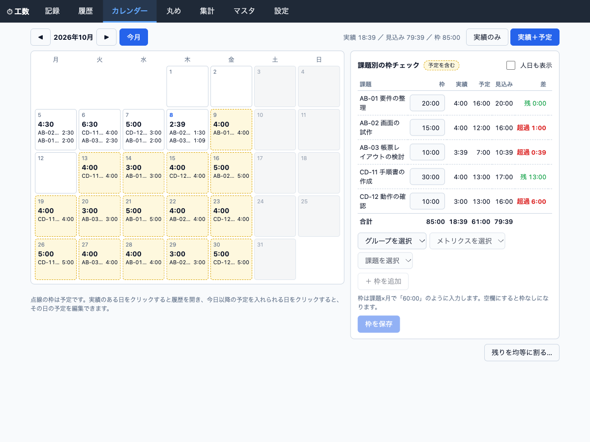
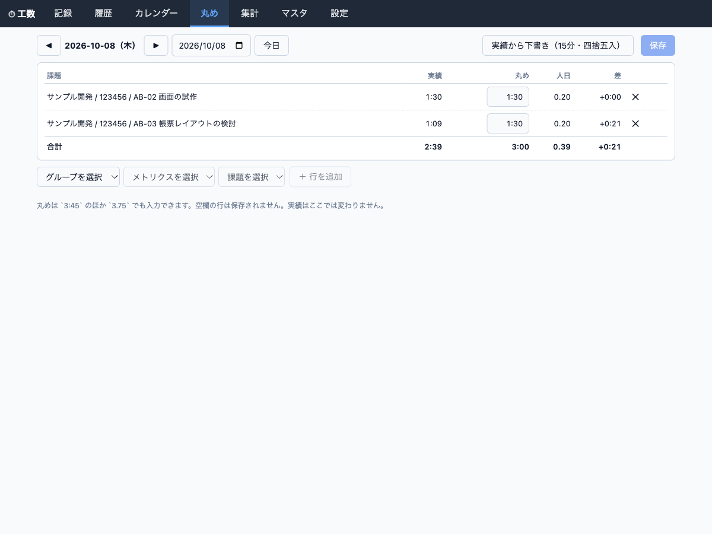
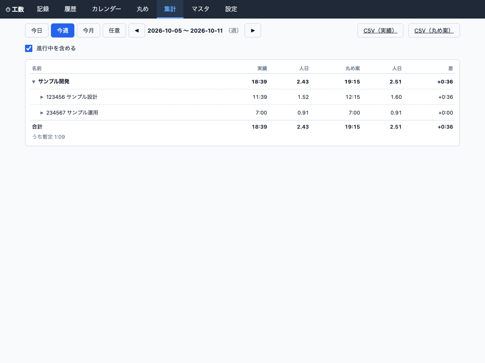
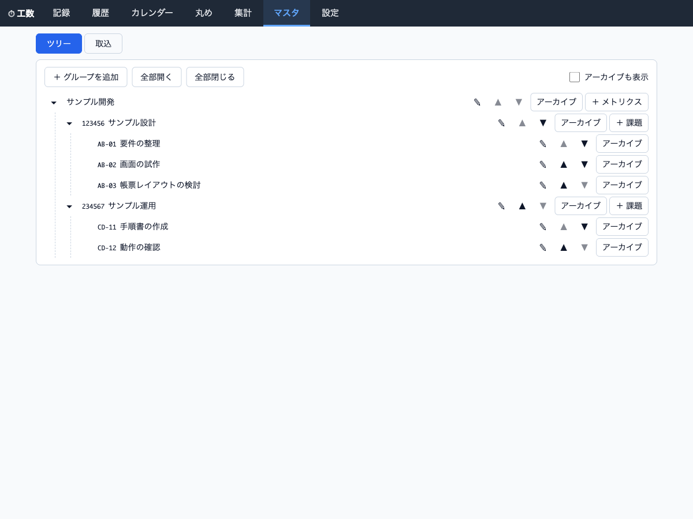
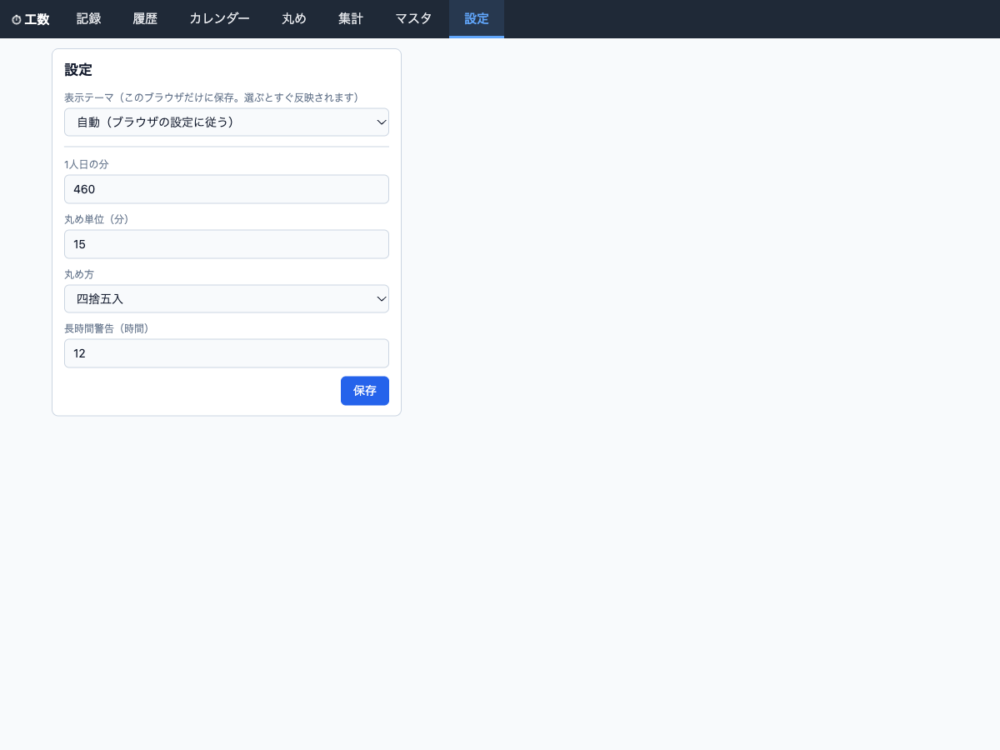

# 作業時間トラッカー マニュアル

このマニュアルは、作業時間トラッカーを自分の PC で動かす人向けです。前半（1〜6章）が入れる・守る・更新する話、後半（7・8章）が画面の使い方と困ったときの対処です。まず動かしたいだけなら、[README.md](README.md) の「起動する」だけ見れば始められます。

読み手は「Docker は入っているが、このアプリは初めて」という前提で書いています。

## 1. これは何か

開始時刻を積む方式のタイムトラッカーです。作業を始めるときに「開始」を押し、作業が変わったら切り替える。それだけで1日の実績が記録され、あとから履歴の編集・丸め・集計・CSV 出力ができます。

実績（実際に計測した時刻そのもの）と、丸め案（会社などへの登録用に手で入れる数字）を別の層として持ちます。丸め案をいくら直しても、実績は変わりません。

**1人用です。** ログインや認証はありません。手元の PC で動かして、自分だけで使う前提の作りです。だから既定では localhost からしかつながりません（4章）。

## 2. 用意するもの

- Docker（`docker compose` が使えること）

これだけです。Node のインストールも、このアプリのソースコードも要りません。データはすべて手元の `./data` に貯まり、外部に送信されません。

## 3. 起動する

空のフォルダを作り、その中で次の2行を実行します。

```sh
curl -O https://raw.githubusercontent.com/jiiiko000/work-time-tracker-dist/main/docker-compose.yml
docker compose up -d
```

ブラウザで http://localhost:8080 を開きます。止めるときは `docker compose down` です。

compose を使わない場合はこちら（同じ内容です）。

```sh
mkdir -p data
docker run -d --name work-time-tracker \
  -p 127.0.0.1:8080:3000 \
  -e TZ=Asia/Tokyo -e DB_PATH=/data/app.db \
  -v "$PWD/data:/data" \
  --restart unless-stopped \
  ghcr.io/jiiiko000/work-time-tracker:latest
```

- イメージは公開されているので `docker login` は要りません。
- Linux では、コンテナが root で動くため `./data` が root 所有になることがあります。先に `mkdir -p data` してから起動すると詰まりにくくなります。詰まったら 8章の対処を見てください。

## 4. 設定できること

環境変数で次の5つを変えられます。**「アプリ単体の既定値」は Docker を使わずに動かす場合の値で、Docker で動かすときは一部が違います。** 実際に効いている値（実効値）は次のとおりです。

| 環境変数 | アプリ単体の既定値 | コンテナでの実効値 | 内容 |
| --- | --- | --- | --- |
| `HOST` | `127.0.0.1` | `0.0.0.0` | 待ち受けアドレス。認証がないため、既定では localhost からのみ。コンテナでは `0.0.0.0` で待ち受け、ホスト側は compose の `ports` で `127.0.0.1` に絞っています |
| `PORT` | `3000` | `3000` | コンテナ内で待ち受けるポート |
| `DB_PATH` | `./data/app.db` | `/data/app.db` | データベースの保存先（コンテナでは `/data` の中だけを使います） |
| `BACKUP_KEEP` | `14` | `14` | 自動バックアップの残す世代数 |
| `TZ` | `Asia/Tokyo` | `Asia/Tokyo` | 日付の境界に使うタイムゾーン。画面は `Asia/Tokyo` 固定で解釈するため、変えると画面とずれる場合があります |

変えたいときは `docker-compose.yml` の `environment` に足します。たとえばバックアップを7世代だけ残すなら `- BACKUP_KEEP=7` を足します。`DB_PATH`・`PORT`・`HOST` を変えるときは、次の点に注意します。

- **`DB_PATH` は必ず `/data` の中にします。** 表の `./data/app.db` はアプリ単体の値です。コンテナでこれをそのまま使うと `/data` の外（`/app/data/app.db`）を指してしまい、標準の compose がマウントしている `./data` に残らず、コンテナを作り直したときにデータを失います。コンテナでは既定の `/data/app.db` から変えないでください。
- **`PORT` を変えるときは、`ports` の右側も同じ値にします。** たとえばコンテナの `PORT` を `8080` にするなら `ports` を `"127.0.0.1:8080:8080"` にします。左側はホストから開く番号、右側はコンテナ内の番号で、片方だけ変えると開けません。あわせて `healthcheck` の `test` に書いてある `3000` も同じ値に変えてください。そのままだと `docker compose ps` が `unhealthy` と表示します（アプリ自体は動いています）。ホスト側の番号の変え方は 8章を見てください。
- **`HOST` は標準の compose では変えません。** `0.0.0.0` でないとホストからつながりません。外からの見え方は `ports` の左側で調整します。

### アプリの設定（画面の「設定」から）

次の4つは環境変数ではなく、画面の「設定」で変えます。値はデータベース（`./data`）に保存されるので、更新しても残ります。

| 項目 | 既定値 | 内容 |
| --- | --- | --- |
| 1人日の分 | `460` | 1人日を何分として数えるか。人日の計算に使います |
| 丸め単位（分） | `15` | 丸め案を作るときの刻み幅 |
| 丸め方 | 四捨五入 | 四捨五入・切り上げ・切り捨てから選びます |
| 長時間警告（時間） | `12` | これを超える長さの実績に警告を出します |

## 5. データとバックアップ

### データの置き場所

- データは、起動したフォルダの `./data` に貯まります（バックアップも同じ場所）。
- データベースのファイルは `./data/app.db` です（コンテナの中では `/data/app.db`）。

### 自動バックアップ

- 起動時に1回、そのあと1時間ごとに、**その日の分がまだ無ければ** `./data/backups/` にバックアップを1つ作ります。ファイル名は `app-YYYY-MM-DD.db`（例: `app-2026-10-08.db`）、つまり**1日1つ**です。同じ日に何度起動しても増えません。日付の境界は `TZ`（既定 `Asia/Tokyo`）です。
- バックアップは SQLite のオンラインバックアップ機能で取るので、アプリを動かしたままでも壊れず、書き込み途中のデータ（WAL にある直近のコミット）も含みます。
- 残す世代数は `BACKUP_KEEP`（既定 `14`）。それを超えた古いものから消していきます。
- バックアップに失敗しても、アプリは止まりません。ログに `[backup] バックアップに失敗しました` と出ます（ログの見方は 8章）。

バックアップはアプリと同じディスク上にあります。PC そのものが壊れたときに備えて、`./data` ごと別の場所（外付けドライブやクラウド）へコピーしておくと安心です。

### 復元する

戻したいバックアップを使って、次の順で戻します。

**この手順は、選んだバックアップより後の実績を失います。** バックアップは1日1つ、その日の分です。たとえば `app-2026-10-08.db` に戻すと、2026-10-08 のバックアップを取った時点より後に記録した実績はすべて消えます（2026-10-09 以降の実績も含みます）。戻す日付をよく確かめてください。消したくない実績があるときは、下の手順2でいまの `data/` を丸ごと退避しておけば、あとから元に戻せます。

1. アプリを止める。

   ```sh
   docker compose down
   ```

   （`docker run` で動かしている場合は `docker stop work-time-tracker`）

2. いまの `data/` を丸ごと、日時を付けた別のフォルダへコピーして退避する。ここで退避しておけば、戻し先を間違えても元に戻せます。アプリを止めた直後は `data/` が動いていないので、そのままコピーしてかまいません。

   ```sh
   mkdir -p backup-before-restore
   cp -a data "backup-before-restore/data-2026-10-08"
   ```

   コピーのときに `Permission denied` が出る場合は、`./data` が root 所有です。8章の「Linux で `./data` が root 所有になってしまった」を先に実行してから、ここに戻ってください。

3. 戻したいバックアップを `app.db` としてコピーする。Linux ではコンテナが root で動くため `data/app.db` が root 所有になっていることがあり、そのままだと `cp` が `Permission denied` で失敗します。`./data` のフォルダが自分のものであれば、先に古いファイルを消してからコピーすれば通ります。

   ```sh
   rm -f data/app.db
   cp data/backups/app-2026-10-08.db data/app.db
   ```

   削除のときにも `Permission denied` が出る場合は、`./data` のフォルダ自体が root 所有です。8章の「Linux で `./data` が root 所有になってしまった」を先に実行してから、ここに戻ってください。

4. 古い `-wal` と `-shm` を消す。これを消さないと、戻した内容に古い書き込みが混ざることがあります。

   ```sh
   rm -f data/app.db-wal data/app.db-shm
   ```

5. アプリを起動する。

   ```sh
   docker compose up -d
   ```

戻したあとで退避した内容のほうが必要になったら、アプリを止めてから `backup-before-restore/data-2026-10-08` の中身を `data/` に戻し、同じ手順で起動し直します。

## 6. 更新する

新しい版が出たら、イメージを引き直して入れ替えます。

```sh
docker compose pull
docker compose up -d
```

データは `./data` にあるので、そのまま残ります。バックアップも消えません。

`docker run` で動かしている場合は、`docker pull ghcr.io/jiiiko000/work-time-tracker:latest` で新しいイメージを引き、いったん `docker stop work-time-tracker` と `docker rm work-time-tracker` で古いコンテナを消してから、3章の `docker run` をもう一度実行します。

## 7. 画面の使い方

画面上部のメニューが、そのまま機能の一覧です。「記録」「履歴」「カレンダー」「丸め」「集計」「マスタ」「設定」の7つです。

最初にやるのは「マスタ」でタスクを登録すること、次に「記録」で計測を始めることです。ふだん開くのはこの2つで、残りは1日や1か月の終わりに見直したり、提出用の数字を作ったりするときに使います。

### 記録



**何のためにあるか**

作業の開始時刻を積む画面です。ここで押した「開始」が、そのまま実績になります。作業が変わったら押し直すだけで、1日の記録ができあがります。

**どう操作するか**

- 作業を始めるときは、下の「次の作業を開始」でグループ・メトリクス・課題を選び、必要ならメモを入れて「▶ 開始」を押します。「最近使ったタスク（ワンクリック開始）」のボタンなら、課題を選ばずにそのまま開始できます。この並びは直近に使ったものから出ます。
- 開始時刻は「今」のほか、時計の欄に時刻を入れて指定することもできます。押し忘れたときに、あとからその時刻に始めたことにできます。
- 別の作業を始めると、前の作業はその時刻で終わります。作業をやめるときは「■ 停止」を押します。
- 計測中は上の緑の枠（進行中）に、今の作業と経過時間が出ます。
- 開始時刻やメモを間違えたら、計測中なら枠の「✎」、終わったあとは「今日のタイムライン」の行の「✎」で直せます。
- 「今日のタイムライン」には、その日の実績と、まだ記録の無い時間帯（「未記録」）が時刻の順に並びます。合計と人日は見出しに出ます。

### 履歴



**何のためにあるか**

1日の実績を時刻の順に並べて見る画面です。記録を後から直したり、押し忘れた時間を埋めたりするのに使います。

**どう操作するか**

- 上の「◀」「▶」と日付で日を切り替えます。「今日」で今日に戻ります。
- 各行の「✎」で開始・終了・課題・メモを直し、「🗑」で消します。消した時間帯は「未記録」の行になります（消す前に確認が出ます）。
- 「未記録」の行には「＋ ここに追加」ボタンがあります。押すとその時間帯の開始・終了が入った状態で入力欄が開くので、課題を選んで追加すれば、記録の無い時間を埋められます。
- 右上の「＋ 実績を追加」では、その日に実績を1件足せます。
- 時刻を直すときは、次の2つに注意します。終了時刻を入れると「停止」扱いになります。開始時刻を変えると、直前の実績の終わりも連動して変わります。
- 設定した時間（4章）を超える実績には、停止忘れの警告が出ます。

### カレンダー



**何のためにあるか**

月の予定を仮で入れて、月末にどれくらいになるかを見る画面です。**予定は見込みを確認するためのもので、実績・丸め・集計には混ざりません。**

**どう操作するか**

- 左のカレンダーが月の一覧です。点線の枠が予定の入った日です。日をクリックすると、実績のある日は履歴が開き、今日以降の予定を入れられる日は、その日の予定の編集欄が開きます。
- 予定の編集欄では、課題ごとに時間を「3:45」の形で入れます。その日を「休みにする」こともできます（休みの日には予定を入れられず、見込みにも入りません）。
- 右の「課題別の枠チェック」には、課題ごとの枠・実績・予定・見込みと、その差（残・超過）が出ます。枠の欄に「60:00」のように入力し、「枠を保存」で確定します。
- 「残りを均等に割る…」は、今日より後の実績の無い営業日に、残りの時間を均等に割り当てて予定を入れます。プレビューを見てから保存します。
- 右上の「実績のみ」「実績＋予定」で、予定を混ぜた見込みを表示するかを切り替えます。

### 丸め



**何のためにあるか**

1日ぶんの実績を課題ごとにまとめ、会社などへ登録する数字（丸め案）を手で入れる画面です。1日1ページです。**ここで入れた数字で実績は変わりません。**

**どう操作するか**

- 上の「◀」「▶」と日付で日を切り替えます。
- 「実績から下書き」を押すと、その日の実績を課題ごとにまとめ、設定した丸め単位と丸め方（4章）で丸めた案を作ってくれます。あとは必要な行だけ手で直します。
- 丸めは `3:45` のほか `3.75` でも入力できます。「✕」でその行の丸めを消せるほか、「＋ 行を追加」で実績の無い課題の行も足せます。空欄の行は保存されません。
- 「実績」「丸め」「人日」「差」が並ぶので、実績とどれだけずれているかがその場で分かります。
- 「保存」でその日ぶんをまとめて保存します。

### 集計



**何のためにあるか**

期間を決めて、グループ→メトリクス→課題のツリーで実績と丸め案をまとめて見る画面です。提出用の CSV もここから出します。

**どう操作するか**

- 「今日」「今週」「今月」か、「任意」で期間を指定します。「◀」「▶」で前後の期間に移ります。
- 「進行中を含める」を外すと、計測中のままの実績を集計から除けます。
- 行の「▶」を押すと、グループやメトリクスの中身が開きます。
- 各行に「実績」「人日」「丸め案」「人日」「差」が出ます。丸め案をまだ入れていない期間は「—」になります。
- 合計の下に「うち暫定」が出ることがあります。これは、いま計測中でまだ止めていない実績が占める時間です。止めると確定します。
- 右上の「CSV（実績）」「CSV（丸め案）」で、表示中の期間の CSV をダウンロードできます。

### マスタ



**何のためにあるか**

記録のときに選ぶ、グループ・メトリクス・課題を登録しておく画面です。ここが空だと記録を始められません。

**どう操作するか**

- 「ツリー」タブは、グループ→メトリクス→課題の3階層です。**既定では課題が閉じていて、グループとメトリクスだけが見えます。** 各段の左の「▸」で開きます。「全部開く」「全部閉じる」でまとめて切り替えられます。上の画像は「全部開く」を押した状態で、すべての課題が見えています。
- 「＋ グループを追加」「＋ メトリクス」「＋ 課題」で足せます。メトリクスと課題には ID（コード）も入れます。
- 各行の「✎」（または名前のダブルクリック）で名称を変え、「▲」「▼」で並び順を変えます。使わなくなったものは「アーカイブ」にすると記録の選択肢から消え、「復元」で戻せます。「アーカイブも表示」にチェックすると、アーカイブ済みも表示されます。
- 「取込」タブでは、Excel からコピーした範囲を貼り付けてまとめて取り込めます。取込先のグループを選び、表を貼り付けて「次へ」、列の対応づけ、プレビュー、の順に進みます。列は「メトリクスID・メトリクス名・課題ID・課題名」です。

### 設定



**何のためにあるか**

数字の数え方と、画面の見た目を変える画面です。

**どう操作するか**

- 「1人日の分」「丸め単位（分）」「丸め方」「長時間警告（時間）」を変えて「保存」を押します。それぞれの意味と既定値は 4章の表を見てください。
- 「表示テーマ」だけは別で、サーバーではなくこのブラウザにだけ保存されます。選ぶとすぐ反映され、保存は要りません。

## 8. 困ったとき

### 様子を見たい

まずログを見ます。

```sh
docker compose logs
```

（`docker run` で動かしている場合は `docker logs work-time-tracker`）

`-f` を付けると流れ続けます。バックアップの成否や、起動時のメッセージはここに出ます。

### ポートを変えたい

`8080` が他のアプリとぶつかるときは、`docker-compose.yml` の `ports` の左側を変えます。`"127.0.0.1:9090:3000"` にすれば http://localhost:9090 で開きます。

### Linux で `./data` が root 所有になってしまった

コンテナが root で動くため、`./data` の所有者が root になることがあります。次のコマンドで自分のものに戻せます。

```sh
sudo chown -R "$USER" data
```

### イメージが引けない

`docker pull` や `docker compose pull` で `unauthorized` や `denied` が出るときは、古い認証情報が残っている可能性があります。ログアウトしてから、もう一度試します。

```sh
docker logout ghcr.io
docker compose pull
```

このイメージは公開されているので、`docker login` は要りません。
